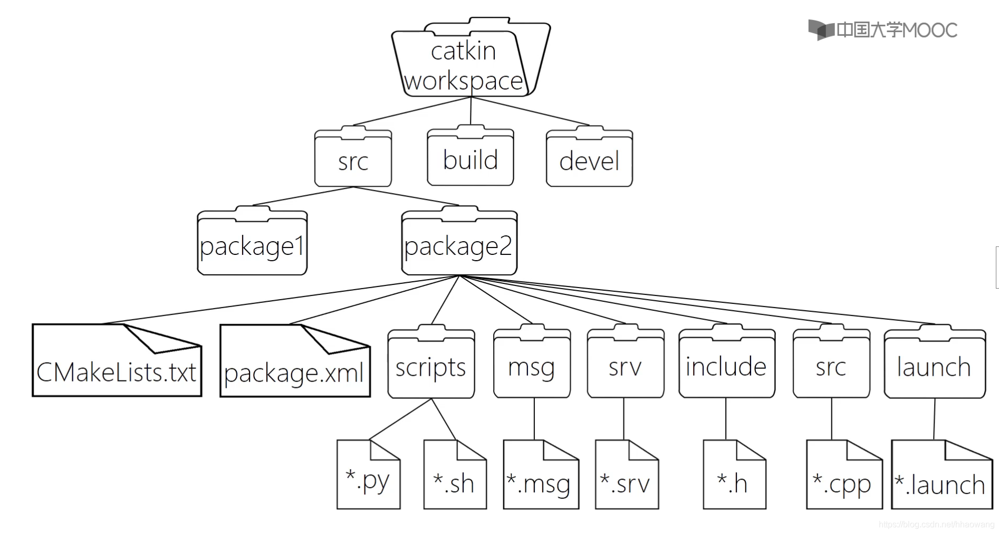

# ros的一个文件概览
  

src:源文件  
build：编译过程中的文件。  
devel：编译生成的可执行文件。  
install：make install命令将可执行文件安装的脚本文件。  

# 创建ros工作空间
一般教程的工作空间名都是catkin_ws为例，需要经如ws中的src文件夹初始化。  

    # mkdir ~/catkin_ws_first/src
    cd ~/catkin_ws_first/src
    catkin_init_workspace