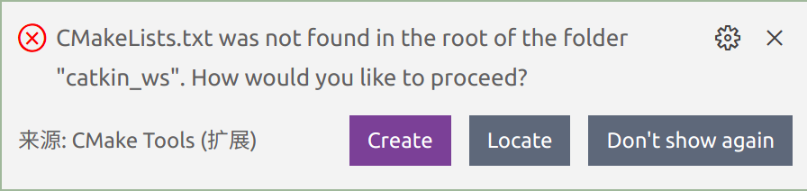
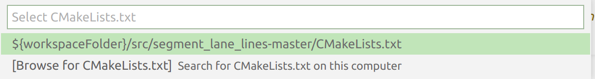
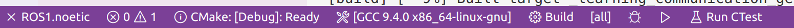
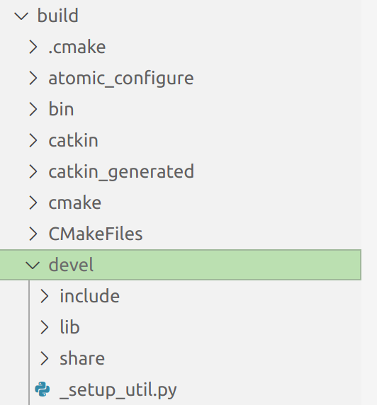

利用scode写ros程序，编译。 

# 没找到catkin，还是用cmake+make吧

# 准备
ros插件，cmake。

# cmake编译
vscode的cmake插件编译似乎在打开的根目录下找CMakeLists文件？于是手动指定其位置：  
  
点Locate，  
  
选择/workspace/src/CMakeLists.txt即可。  
然后cmake，生成build文件夹。

# make
底部栏：  
  
点build，生成devel文件夹。  
奇怪的是自动生成的devel是在build目录下。。。暂时还没找到其生成在build同级目录下的方法。  
