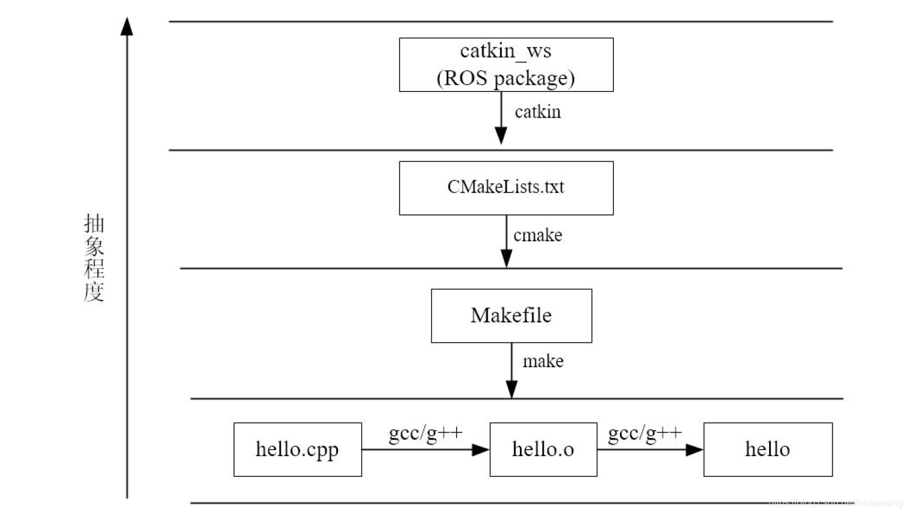
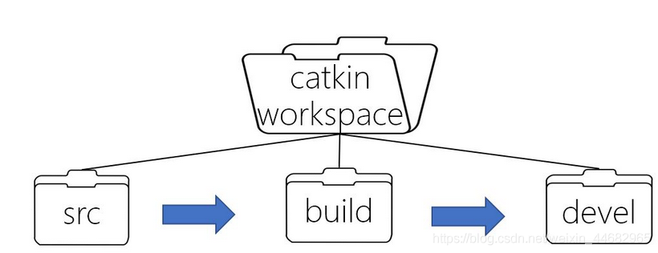

# 编译工具catkin_make

# catkin编译过程
catkin相当于cmake+make：
- 查看工作空间(catkin_ws)下src目录中的package
- 根据CMakeists.txt和Package.xml，生成makefiles(catkin_ws/build)
- make makefiles文件，生成可执行文件，在catkin_ws中

  
  

# 基本编译过程
    mkdir -p ~/catkin_ws/src
    cd catkin_ws/src
    catkin_init_workspace #建立工作空间
    catkin_create_pkg package1 rospy roscpp std_msgs #创建功能包，catkin_create_pkg+包名+依赖包
    cd ~/catkin_ws #转移到工作空间目录下
    catkin_make #编译

## 编译后添加工作空间的环境变量到系统中
- 仅在当前终端生效  
    `source devel/setup.bash`
- 在所有终端生效  
    `echo "source/WORKSPACE/devel/setup.bash">>~/.bashrc`
    `source ~/.bashrc`
- 查看是否添加成功：  
    `echo $ROS_PACKAGE_PATH`

# catkin_make 命令
> catkin_make [make_targets] [-DCMAKE_VARIABLES=...]  
> catkin_make -DCATKIN_WHITELIST_PACKAGES="package1;package2"  

# 编译文件：CMakeLists

## CMakeLists基本内容
    cmake_minimun_required()#CMake版本号
    project()#项目名
    find_package()#找到编译需要的其他包
    catkin_python_setup()#打开python module支持
    add_message_files()#添加自定义的Message/Service/Action文件
    add_service_files()
    add_action_files()
    generate_message()#生成不同语言版本的msg/sv/action接口
    catkin_package()#生成当前package的cmake配置,供依赖本包的其他软件包调用
    add_library()#生成库
    add_executable()#生成可执行文件
    target_link_libraries()#链接
    catkin_add_gtest()#生成测试
    install()#安装至本机

## ROS海龟的CMakeLists
    cmake_minimun_required(VERSION 3.0.2)
    project(turtlesim)#$(PROJECT_NAME引用项目名称)

    find_package(catkin REQUIRED COMPONENTS 
    roscpp
    roscpp_serialization
    roslib
    rostime
    rosconsole
    std_msgs
    std_srvs
    geometry_msgs
    message_generation
    )#指定依赖包(catkin是必备以来，其余为组件)
    find_package(QT5Weights REQUIRED)
    find_package(Boost REQUIRED COMPONENTS thread)

    include_directories(include ${catkin_INCLUDE_DIRS} ${Boost_INCLUDE_DIRS})#指定C++的头文件路径
    link_directories(${catkin_LIBRARY_DIRS})#指定链接库的路径
    add_message_files(DIRECTORY msg FILES
    COlor.msg Pose.msg)#自定义msg文件
    add_service_files(DIRECTORY srv FILES
    Kill.srv
    SetPen.srv
    Spawn.srv
    TeleportAbsolute.srv
    TeleportRelative.srv)#自定义srv文件

    generate_messages(DEPENDENCIES geometry_msgs std_,sgs std_srvs)#add_message_files、add_service_files之后必须加上这句话,用于生成头文件，文件位于devel/include中

    catkin_package(CATKIN_DEPENDS geometry_msgs message_runtime std_msgs std_srvs)# 配置ROS的package配置文件和CMake文件
    # 必须在add_library()或者add_executable()之前调用
    # 有5个可选参数：
    # INCLUDE_DIRS - 导出包的include路径
    # LIBRARIES - 导出项目中的库
    # CATKIN_DEPENDS - 该项目依赖的其他catkin项目
    # DEPENDS - 该项目所依赖的非catkin CMake项目。
    # CFG_EXTRAS - 其他配置选项

    set(turtlesim_node_SRCS
    src/turtlesim.cpp
    src/turtle.cpp
    src/turtle_frame.cpp
    )
    set(turtlesim_node_HDRS
    include/turtlesim/turtle_frame.h
    )#指定turtlesim_node_SRCS、turtlesim_node_HDRS变量
    qt5_wrap_cpp(turtlesim_node_MOCS ${turtlesim_node_HDRS})

    add_executable(turtlesim_node ${turtlesim_node_SRCS} ${turtlesim_node_MOCS})# 指定可执行文件目标turtlesim_node
    target_link_libraries(turtlesim_node Qt5::Widgets ${catkin_LIBRARIES} ${Boost_LIBRARIES})# 指定链接可执行文件
    add_dependencies(turtlesim_node turtlesim_gencpp)

    add_executable(turtle_teleop_key tutorials/teleop_turtle_key.cpp)
    target_link_libraries(turtle_teleop_key ${catkin_LIBRARIES})
    add_dependencies(turtle_teleop_key turtlesim_gencpp)

    add_executable(draw_square tutorials/draw_square.cpp)
    target_link_libraries(draw_square ${catkin_LIBRARIES} ${Boost_LIBRARIES})
    add_dependencies(draw_square turtlesim_gencpp)

    add_executable(mimic tutorials/mimic.cpp)#指定可执行目标
    target_link_libraries(mimic ${catkin_LIBRARIES})＃链接
    add_dependencies(mimic turtlesim_gencpp)＃依赖

    install(TARGETS turtlesim_node turtle_teleop_key draw_square mimic
    RUNTIME DESTINATION ${CATKIN_PACKAGE_BIN_DESTINATION})# 安装目标文件到本地系统

    install(DIRECTORY images
    DESTINATION ${CATKIN_PACKAGE_SHARE_DESTINATION}
    FILES_MATCHING PATTERN "*.png" PATTERN "*.svg")